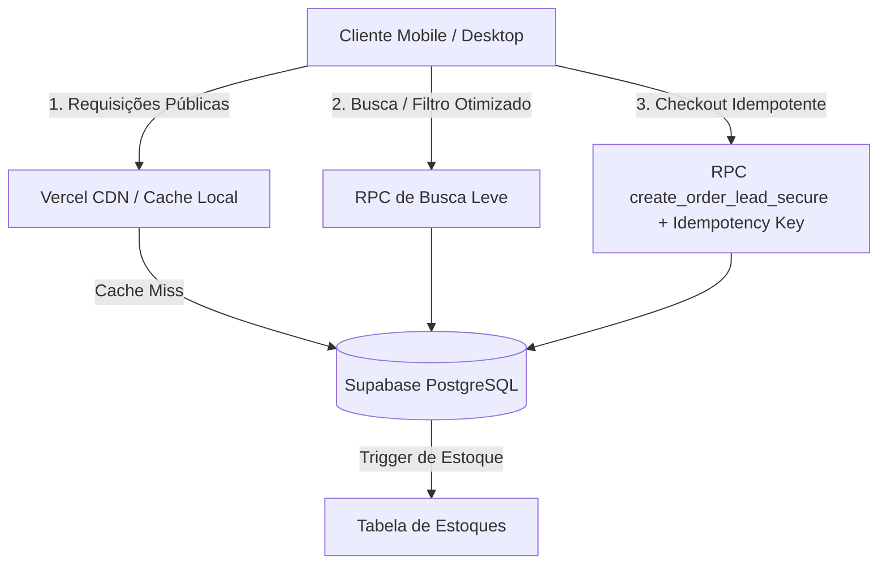

# TFBrand - Plano de Escalabilidade e Resiliência

## 1. Auditoria de Gargalos Identificados

Esta seção documenta a análise crítica da arquitetura atual do e-commerce TFBrand, mapeando os pontos de ineficiência, consumo excessivo de recursos de banco de dados e riscos sob alta carga de acessos concorrentes.

### 1.1. Consultas Mais Frequentes e Pesadas
* **`getPublicProducts`**: Atualmente executa uma consulta completa (`select('*')`) em todas as tabelas relacionadas: `products`, `categories`, `product_variations`, `product_images` e `product_sizes`.
  * **Problema**: Baixa todos os produtos publicados do banco para o frontend.
  * **Impacto**: O payload cresce linearmente com o catálogo. Sob 300 acessos simultâneos, essa consulta sobrecarrega a banda do Supabase e o uso de CPU do banco de dados PostgreSQL.
* **Agregação Dinâmica em `applyDynamicBadges`**:
  * **Problema**: Para determinar os 10 produtos "Mais Vendidos", o código realiza uma consulta na tabela `analytics_events` buscando **todas** as linhas onde `event_type = 'whatsapp_click'` para depois contar e ordenar no JavaScript do cliente.
  * **Impacto**: Se a tabela contiver 50.000 eventos de clique, todos serão baixados no navegador de cada usuário. Isso inviabiliza o carregamento da página por gargalo de banda e estouro de memória no cliente.

### 1.2. Componentes com Requests Duplicados ou Ineficientes
* **Loader de `/product/$id` (Página de Detalhes)**:
  * **Problema**: O loader da página de detalhes do produto executa `getPublicProducts()` (catálogo inteiro) e depois usa `.find(p => p.id === id)` na memória do navegador.
  * **Impacto**: Baixar todo o catálogo para visualizar apenas um item é extremamente ineficiente e aumenta drasticamente as leituras desnecessárias no Supabase.
* **Filtros e Busca Locais**:
  * **Problema**: A rota `/produtos` puxa todo o catálogo no loader e faz filtragem (por preço, cor, tamanho) em JavaScript.
  * **Impacto**: Embora poupe chamadas subsequentes ao banco para filtros, o carregamento inicial é lento e vulnerável a picos de tráfego.

### 1.3. Uso de `select('*')` e Joins Excessivos
* Consultas em `getPublicProducts`, `getPublicProductBySlug`, `getCategories` e `getStoreSettings` fazem `select('*')` indiscriminado.
* Colunas pesadas como descrições completas (`description`), guia de tamanhos (`size_guides`), dicas de caimento (`fit_tip`), composições e instruções de cuidado (`care_instructions`) são carregadas na listagem de vitrine, onde apenas dados resumidos de card (preço, nome, imagem principal, SKU) são exibidos.

### 1.4. Busca Ineficiente
* O motor de busca atual (`searchProducts` em `search.service.ts`) lê todo o catálogo público via `getPublicProducts()` e roda o algoritmo de relevância localmente.
* A busca no cabeçalho não possui cancelamento de requisição ativa no React e dispara a cada digitação sem limite rígido no banco de dados.

### 1.5. Vulnerabilidades no Fluxo de Checkout e Pedidos (WhatsApp)
* A RPC `create_order_lead_secure` é chamada diretamente no clique de finalizar pedido.
* **Falta de Idempotência**: Se o cliente clicar repetidas vezes no botão "Finalizar Pedido" devido a uma instabilidade na conexão, serão gerados múltiplos leads idênticos no banco de dados.
* **Preço Não Recalculado Totalmente**: A validação de preço já ocorre no banco de dados via RPC, o que é excelente. Porém, o subtotal do carrinho não possui restrições fortes contra envio repetido por idempotência na tabela `leads`.

### 1.6. Logs e Métricas de Analytics Brutas
* Eventos como `view_item` ou cliques no WhatsApp são inseridos na tabela `analytics_events`. O admin lê essa tabela de forma agregada no JS ou sem paginação adequada, o que gera gargalo quando a base de dados cresce.

---

## 2. Pontos de Cache Seguro vs. Proibido

Para otimizar o Supabase e reduzir leituras, a arquitetura deve aplicar cache estratégico de acordo com a mutabilidade do dado.

### 2.1. Pontos que PODEM ser cacheados com segurança (Cache Público)
* **Categorias (`categories`)**: Dados estáticos de configuração. Cache longo (ex: `staleTime: 10 min`, `gcTime: 30 min`).
* **Configurações da Loja (`store_settings`)**: Raramente modificadas pelo painel administrativo. Cache longo.
* **Cards da Vitrine / Catálogo Resumido**: Dados públicos e idênticos para todos os visitantes. Podem ter cache de revalidação rápida no frontend (TanStack Query) e CDN (headers `Cache-Control: public, max-age=60, stale-while-revalidate=600`).
* **Páginas de Detalhes de Produto**: Cache no cliente (TanStack Query). O preço e estoque podem ser revalidados localmente.
* **Imagens do Storage / Cloudinary**: Devem ser cacheadas permanentemente (cache longo) na CDN do provedor de imagem usando URLs únicas baseadas em hash de arquivo.

### 2.2. Pontos que JAMAIS podem ser cacheados (Cache Privado/Proibido)
* **Área do Painel Admin (`/admin/*`)**: Gestão de catálogo, pedidos e configurações.
* **Autenticação, MFA e Sessões**: Dados de tokens JWT do Supabase Auth.
* **Pedidos e Leads (`leads`)**: Dados privados de clientes e checkouts concorrentes.
* **Carrinho Individual e Sacola**: Dados específicos do dispositivo do cliente, gerenciados no local store localmente sem expor a CDNs ou outros clientes.

---

## 3. Estratégia de Mitigação e Arquitetura Proposta

### 3.1. Otimização do Catálogo Público
* Implementar método `getPublicProductsCardData` que faz select apenas das colunas mínimas do card e limita o retorno a **12 produtos iniciais**.
* Implementar paginação real baseada em offset ou cursor.
* Criar uma RPC leve `get_top_bestseller_ids()` que roda o agrupamento (`GROUP BY`) e contagem no banco de dados e retorna apenas o top 10 IDs mais vendidos para o frontend, resolvendo o gargalo de banda do `applyDynamicBadges`.

### 3.2. Busca Otimizada no Servidor
* Substituir a busca em catálogo completo local por uma busca indexada no PostgreSQL com a query ou RPC limitando em 6 resultados (sugestões) e 12 resultados por página (catálogo).
* Implementar debounce rígido de 300ms e verificação de mínimo de 2 caracteres no input de busca.

### 3.3. Idempotência e Proteção do Checkout
* Adicionar coluna `idempotency_key` (UUID/text) com constraint única na tabela `leads` no banco de dados.
* Atualizar a RPC `create_order_lead_secure` para:
  1. Aceitar `p_idempotency_key`.
  2. Tentar inserir o lead. Se a chave já existir, capturar a exceção e retornar o lead correspondente já cadastrado sem duplicar.
* Frontend: Desabilitar o botão durante a submissão, exibir spinner e armazenar temporariamente a chave do checkout no estado para evitar reenvios.

### 3.4. Otimização de Imagens e Baixo Consumo
* Aplicar o lazy loading (`loading="lazy"`) e decodificação assíncrona (`decoding="async"`) nas imagens abaixo da primeira dobra.
* Forçar dimensões corretas injetando parâmetros de otimização de largura e qualidade do Cloudinary (`q_auto,f_auto,w_xxx`).
